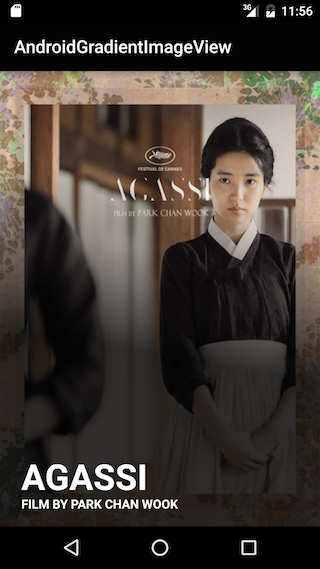

# AndroidGradientImageView

AndroidGradientImageView is a simple imageview which overlays gradient on its content like below:



## Setup Gradle

```groovy
dependencies {
    ...
    compile 'kr.pe.burt.android.lib:androidgradientimageview:0.0.1'
}
```

## Attributes

AndroidGradientImageView is a simple imageview. It just provides a few attributes for gradient effect.

 * giv_x
 	* is left position of gradient 
 	* is float value
 	* you can set value from 0.0 to 1.0 
 * giv_y
	* is top position of gradient 
 	* is float value
 	* you can set value from 0.0 to 1.0 
 * giv_width
	* is gradient's width
 	* is float value
 	* you can set value from 0.0 to 1.0 
 * giv_height
	* is gradient's height
 	* is float value
 	* you can set value from 0.0 to 1.0 
 * giv_rotate
	* is rotation degree of gradient
 	* is float value
 	* you can set value from 0.0 to 360.0
 * giv_startColor
	* is start color of gradient
 	* is color value
 	* you can set value as `#FFFFFF` or `@color/what_color`
 * giv_endColor
	* is end color of gradient
 	* is color value
 	* you can set value as `#FFFFFF` or `@color/what_color`
 * giv_middleColor
	* is middle color of gradient
 	* is color value
 	* you can set value as `#FFFFFF` or `@color/what_color`
 * giv_startOffset
	* is offset of start color of gradient
 	* is float value
 	* you can set value from 0.0 to 1.0
 * giv_middleOffset
	* is offset of middle color of gradient
 	* is float value
 	* you can set value from 0.0 to 1.0
 * giv_endOffset
	* is offset of end color of gradient
 	* is float value
 	* you can set value from 0.0 to 1.0

## Examples

```xml
<kr.pe.burt.android.lib.androidgradientimageview.AndroidGradientImageView
        android:src="@mipmap/ic_launcher"
        android:layout_width="match_parent"
        android:layout_height="match_parent"
        android:scaleType="fitXY"
        app:giv_x="0.0"
        app:giv_y="0.0"
        app:giv_rotate="45.0"
        app:giv_startColor="#8F00"
        app:giv_startOffset="0.3"
        app:giv_middleColor="#80F0"
        app:giv_middleOffset="0.6"
        app:giv_endColor="#800F"
        app:giv_endOffset="0.8"
        />
```

or you can set attributes just you need

```
<kr.pe.burt.android.lib.androidgradientimageview.AndroidGradientImageView
        android:src="@drawable/agassi"
        android:layout_width="match_parent"
        android:layout_height="match_parent"
        android:scaleType="fitXY"
        app:giv_rotate="45.0"
        app:giv_startOffset="0.3"
        app:giv_endColor="#c000"
        app:giv_endOffset="0.6"
        />
```

## MIT License

The MIT License (MIT)

Copyright (c) 2016 Sungcheol Kim, [https://github.com/skyfe79/AndroidGradientImageView](https://github.com/skyfe79/AndroidGradientImageView)

Permission is hereby granted, free of charge, to any person obtaining a copy
of this software and associated documentation files (the "Software"), to deal
in the Software without restriction, including without limitation the rights
to use, copy, modify, merge, publish, distribute, sublicense, and/or sell
copies of the Software, and to permit persons to whom the Software is
furnished to do so, subject to the following conditions:

The above copyright notice and this permission notice shall be included in all
copies or substantial portions of the Software.

THE SOFTWARE IS PROVIDED "AS IS", WITHOUT WARRANTY OF ANY KIND, EXPRESS OR
IMPLIED, INCLUDING BUT NOT LIMITED TO THE WARRANTIES OF MERCHANTABILITY,
FITNESS FOR A PARTICULAR PURPOSE AND NONINFRINGEMENT. IN NO EVENT SHALL THE
AUTHORS OR COPYRIGHT HOLDERS BE LIABLE FOR ANY CLAIM, DAMAGES OR OTHER
LIABILITY, WHETHER IN AN ACTION OF CONTRACT, TORT OR OTHERWISE, ARISING FROM,
OUT OF OR IN CONNECTION WITH THE SOFTWARE OR THE USE OR OTHER DEALINGS IN THE
SOFTWARE.
